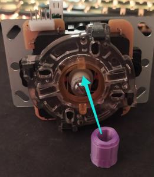
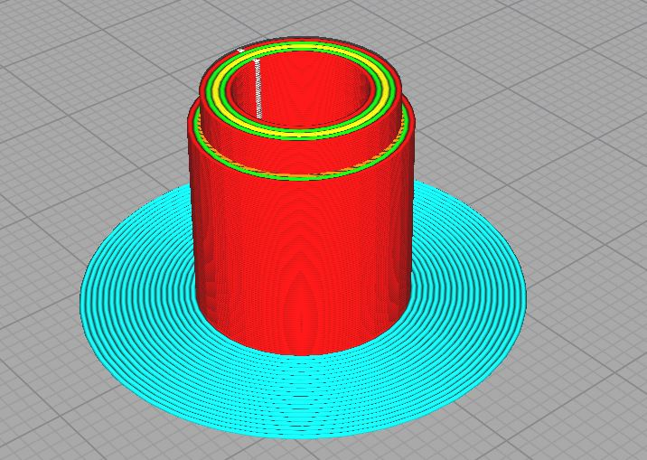
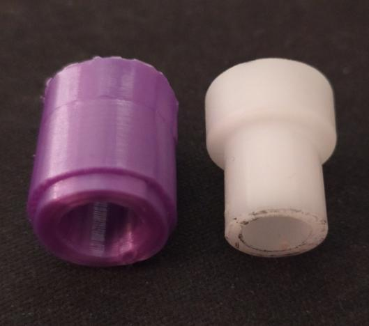
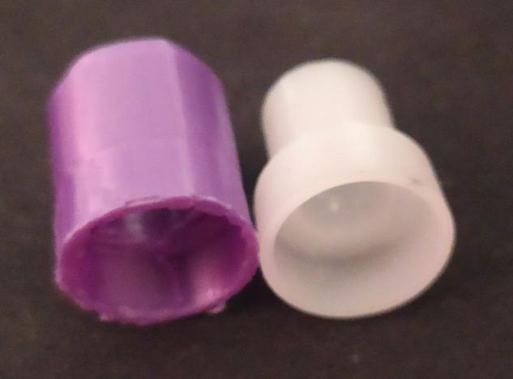
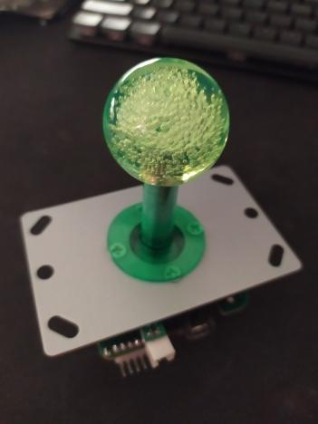

# custom_actuator_arcade_joystick
Custom actuator for arcade joystick

## Description
This actuator was made to gain in precision and reactivity with my joystick, making dashes easier in fighting games.
- `actuator1.1.stl` is the file you realy need here. You can use it with [Ultimaker Cura](https://ultimaker.com/software/ultimaker-cura).
- `actuator1.1.c4d` if you whant to customise it using Cinema4d.
- `AET4X_actuator1.1.gcode` is the file I use to print it on my ET4X.

If you are using Ultimaker Cura, you have to specify the density of the print, so please make it at 100%. Your build will be more robust. It only requiers 2g of PLA.

## Overview

## Target joystick
This actuator was made for default joystick size. Mine is a sanwa ripoff I think.

